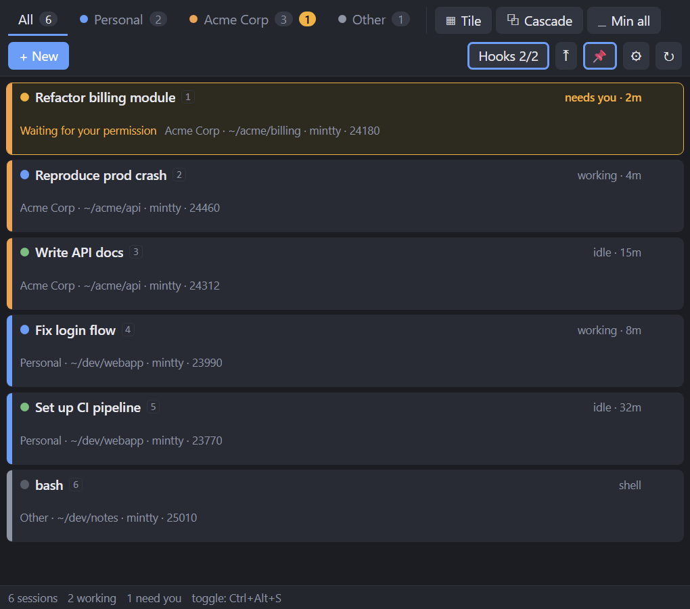

# Satchel

A launcher + window manager for terminal windows. Built for juggling many **Claude Code** sessions
across several accounts, usable for any shell.

Satchel does **not** host terminals. Every session stays a normal terminal window (git-bash / mintty
on Windows); Satchel launches them with the right environment, keeps them in one list grouped by
tabs, shows what each one is doing, and lets you focus / tile / minimize them.



> Sessions above are illustrative. Satchel groups your real terminals by account (e.g. personal vs. work), shows each one's live status, and flags the ones waiting on you.

## How it works

* **Profiles** (`~/.satchel/config.json`) = environment + folder + command + group.
  On first run Satchel detects your Claude config dirs (`~/.claude`, `~/.claude-<name>`) and creates
  one profile per account (`CLAUDE_CONFIG_DIR` set accordingly) plus a plain `Shell` profile.
* **Launch** spawns the terminal with that environment and remembers the process. **Adopt** picks up
  terminal windows you opened yourself (anything in `adoptExecutables`).
* **Status** comes from the window title. Claude Code rewrites it: `✳ topic` when idle,
  `◐ ◓ ◑ ◒` while working. A session that goes working → idle while you are elsewhere is flagged
  **needs you** (row highlight + tab badge + desktop notification) until you focus it.
* **Hooks** (optional, precise): a Claude Code hook script reports *Stop* / *Notification* /
  *UserPromptSubmit* events, so permission prompts and finished tasks light up immediately.

Architecture: platform-independent core (`src/main/sessions.js`, config, hooks) + one
**window backend** per OS (`src/main/backends/`) + **terminal adapters** (`src/main/terminals/`).

| Backend | Status |
|---|---|
| `win32` (koffi → user32, no native build) | working |
| `linux` (wmctrl + xdotool, X11 only) | experimental, untested; status-only on Wayland |
| `darwin` | stub (status-only) — needs Accessibility API work |

## Run

**Build the exe (recommended):** double-click `build.bat` (or `npm install && npm run build`).
It produces `dist\Satchel-win32-x64\Satchel.exe` — no installer, just run it, pin it to the
taskbar, or make a shortcut. Rebuild after pulling changes.

**`satchel.bat`** launches the built exe if present, otherwise the dev checkout via Electron
(installing dependencies on first run). With arguments it runs the CLI (`satchel.bat --list`).

**Dev mode:**

```bash
npm install
npm start
```

Requires Node ≥ 20 (Electron 39 and @electron/packager 18 are pinned because they still install
on Node 20). `npm run icon` regenerates `build/icon.png` / `icon.ico` from `build/make-icon.js`.

**New session:** `+ New` (or `Ctrl+N`) opens the same small **Profile / Folder / Label** dialog in
both panel and docked mode, so you can set the folder and a description everywhere. It remembers the
last profile you used. The tray's *New session ▸ profile* still launches a profile immediately with
its defaults.

**Dock:** the ⤒ button (or tray → *Dock*) turns the panel into a taskbar-like strip on the top or
bottom edge of the selected display, laid out left→right as: group pills (filters) │ Tile / Cascade /
Min all │ one chip per session (colour bar, label, status dot, orange when it needs you) │
`+ New`, ⚙, ⤓ undock. On Windows the strip registers as an *AppBar*, so the work area shrinks and
maximized windows (and Satchel's own tiling) stay clear of it; elsewhere it is a plain
always-on-top strip. `dock.height` in config sets the thickness; the mode and the selected group are
remembered across restarts. In the docked strip, clicking a group pill also **brings that group's
non-minimized windows to the front** (re-click to re-raise) — set `raiseGroupOnSelect: false` in
config to turn that off.

**Tray:** closing the panel hides it to the tray (`closeToTray`, default on). Click the tray icon to
toggle the panel; right-click for *Show*, *New session ▸ profile*, *Tile all*, *Minimize all*, *Quit*.
The tooltip shows the session summary and the icon gets an orange badge while any session needs
you. `startMinimized: true` starts hidden (handy for autostart); `Satchel.exe --quit` /
`satchel.bat --quit` stops a running instance.

Keyboard: `Ctrl+N` new session · `Ctrl+1..9` focus the n-th row of the current tab · `F2` rename
the focused row · `Esc` close the form · global `Ctrl+Alt+S` shows/hides Satchel.

Row click = focus that terminal. Right-click / `⋯` = rename, move to group, minimize, close, forget.

## Install on another machine

**Another Windows x64 PC:** the built app is self-contained — Electron/Chromium and koffi's native
binary are bundled, so **no Node or Electron install is required on the target**. Copy the whole
`dist\Satchel-win32-x64\` folder (≈330 MB — the exe needs its sibling DLLs/`.pak` files) and run
`Satchel.exe`. First launch of an unsigned exe may trip SmartScreen (*More info → Run anyway*).

On first run it writes `~/.satchel/config.json` on **that** machine, auto-detecting Git's mintty
path and creating one profile per `~/.claude*` config dir found there. Adjust the profiles' `cwd`
and `CLAUDE_CONFIG_DIR` to match, then click **Hooks**.

Target-machine prerequisites:

| Need | For | If missing |
|---|---|---|
| Claude Code CLI | running `claude` in a session | — (that's the point) |
| Git for Windows | the mintty terminal | set `terminal.path`, or use a `custom` terminal |
| `node` on PATH | the Claude hooks only | hooks silently no-op; title-based status still works |

Nothing is hard-coded to the build machine — everything machine-specific lives in
`~/.satchel/config.json`, which regenerates. You can also just build on the other machine
(`build.bat`, needs Node ≥ 20).

**macOS / Linux:** not ready — only the Windows window backend is implemented (Linux is
experimental/X11-only, macOS is a stub). You'd package for that OS and finish its backend first.

## Config (`~/.satchel/config.json`)

```jsonc
{
  "pollIntervalMs": 1000,
  "alwaysOnTop": true,
  "hotkey": "CommandOrControl+Alt+S",
  "notifications": true,
  "adoptForeign": true,                      // track terminals you opened outside Satchel
  "adoptExecutables": ["mintty.exe", "WindowsTerminal.exe", "wezterm-gui.exe", "alacritty.exe"],
  "defaultGroup": "Other",
  "terminal": { "type": "mintty", "path": "C:\\Program Files\\Git\\usr\\bin\\mintty.exe" },
  "groups": [ { "name": "Personal", "color": "#4f9cff" }, { "name": "Company", "color": "#ff9f43" } ],
  "profiles": [
    { "name": "Claude personal", "group": "Personal", "cwd": "~", "command": "claude",
      "env": { "CLAUDE_CONFIG_DIR": "C:/Users/me/.claude" } },
    { "name": "Claude company",  "group": "Company",  "cwd": "P:/work", "command": "claude --resume",
      "env": { "CLAUDE_CONFIG_DIR": "C:/Users/me/.claude-company" } },
    { "name": "Shell", "group": "Other", "cwd": "~", "command": "" }
  ],
  "statusGlyphs": { "idle": ["✳"], "working": ["◐", "◓", "◑", "◒"] },
  "attention": { "onIdle": true, "onHook": true }
}
```

`command` runs first, then the window drops into an interactive shell (so closing Claude does not
close the window). Use the `⚙` button to open the file and `↻` to reload it.

Other terminals: `"terminal": { "type": "custom", "argv": [...] }` with placeholders
`{cwd} {title} {shell} {command}` — e.g. for Alacritty:
`["alacritty", "--working-directory", "{cwd}", "--title", "{title}", "-e", "bash", "-lic", "{command}"]`.
Windows Terminal is *not* a good fit: its tabs share one window, so they cannot be tracked, focused
or tiled individually.

## Claude Code hooks (optional but recommended)

Click **Hooks** in the toolbar — Satchel merges its hook into `settings.json` of every Claude config
dir referenced by your profiles (plus `~/.claude`), keeping existing hooks and writing a one-time
`settings.json.satchel-backup`. The button shows `Hooks 2/2` when all dirs are wired; clicking it
then shows the status and offers **Remove hooks** (which takes out only Satchel's entries).

What you get:

* **precise "needs you"** — permission prompts (`Notification`) and finished turns (`Stop`) light up
  immediately, without waiting for the title to change;
* **automatic grouping of adopted windows** — the hook runs inside Claude's process, so it reports
  `CLAUDE_CONFIG_DIR`; Satchel walks the process tree (hook → claude → bash → mintty) to find the
  window and moves it into the profile's group (Personal / Company …). A group you set by hand is
  never overridden;
* the session's real `cwd` and Claude session id per row.

Hooks take effect for Claude sessions started after installation. The hook runs `node`, so `node`
must be on the PATH Claude Code uses.

Manual alternative — add to `settings.json` in each config dir:

```json
{
  "hooks": {
    "SessionStart":     [{ "hooks": [{ "type": "command", "command": "node \"P:/Projects/Me/Satchel/hooks/claude-code-hook.js\"" }] }],
    "UserPromptSubmit": [{ "hooks": [{ "type": "command", "command": "node \"P:/Projects/Me/Satchel/hooks/claude-code-hook.js\"" }] }],
    "Notification":     [{ "hooks": [{ "type": "command", "command": "node \"P:/Projects/Me/Satchel/hooks/claude-code-hook.js\"" }] }],
    "Stop":             [{ "hooks": [{ "type": "command", "command": "node \"P:/Projects/Me/Satchel/hooks/claude-code-hook.js\"" }] }]
  }
}
```

The script appends one JSON line per event to `~/.satchel/events.jsonl`; Satchel tails it. Events
are matched to sessions through the `SATCHEL_ID` environment variable Satchel sets at launch, so
they work for sessions started from Satchel (adopted windows rely on title polling only).

## CLI (development / scripting)

```bash
npx electron . --list                                   # dump sessions as JSON
npx electron . --launch "Claude personal" --cwd P:/x --label "fix tests"
npx electron . --focus <pid|id-prefix>
npx electron . --tile Personal --display <id>
npx electron . --displays
```

The CLI runs its own instance, so a launch done from the CLI while the GUI is open shows up in the
GUI as an *adopted* window (a control socket for the GUI is on the roadmap).

Dev aids for the GUI: `--screenshot <file.png>` captures the panel after `--screenshot-delay <ms>`
(default 2500); add `--screenshot-every <ms>` to keep overwriting it. `SATCHEL_HOME=<dir>` points
all data files somewhere else (handy for testing with a throwaway config).

## Tests

```bash
npm test
```

`test/sessions.test.js` drives the core with an in-memory backend (adoption, status, attention,
hook matching through the process tree, auto-grouping, launch, tile, forget);
`test/win32.test.js` covers command-line quoting / environment blocks and enumerates real windows
(skipped off Windows).

## Files

```
~/.satchel/config.json     profiles, groups, terminal, options
~/.satchel/sessions.json   labels/groups of live sessions (survives restarts)
~/.satchel/state.json      window position, pin state
~/.satchel/events.jsonl    hook events (append-only, safe to delete)
```

## Roadmap

* macOS backend (AX API), Linux X11 test pass, Wayland status-only mode
* title-token matching for terminal servers (gnome-terminal, Terminal.app) where pid ≠ window owner
* packaging as a signed installer (electron-builder), auto-update
* per-row cwd for adopted windows, "open folder" / "copy path" actions
* control socket so the CLI talks to the running GUI instead of starting its own instance

## Credits & license

Satchel is a project of **PEDREA, spol. s r. o.**, built in pair-programming with
[Claude Code](https://claude.com/claude-code) (Anthropic) — Claude wrote the bulk of the
implementation, while product direction, decisions, and testing on real hardware were done by the
author.

Licensed under the [MIT License](LICENSE).
